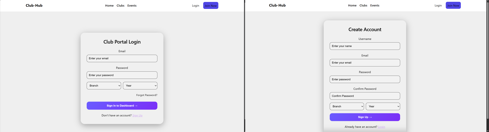
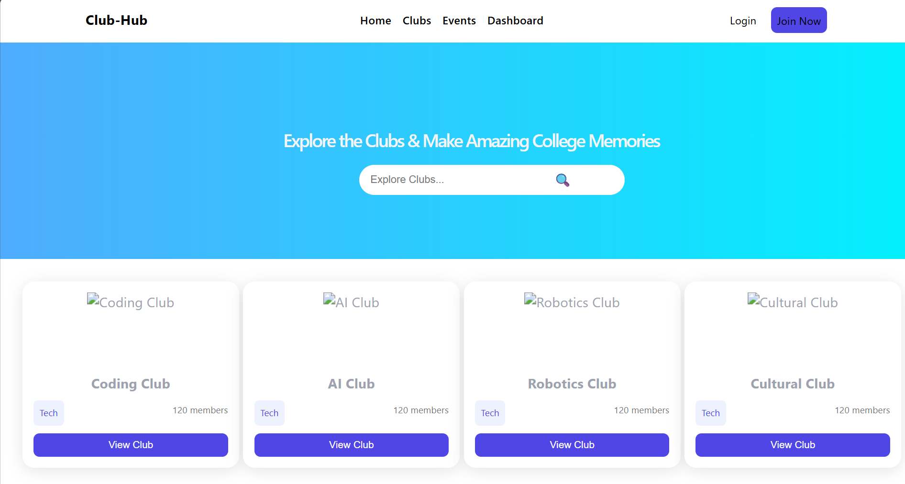
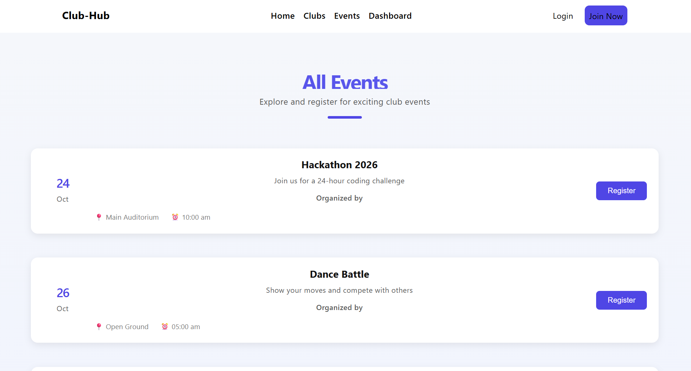

## 📅 Daily Progress

### Day 1

- Project setup
- Initialized GitHub repo
- Landing page with navbar and hero section

## 📸 Screenshots

### Day 2

- Stat section created and updated

## 📸 Screenshots

### Day 3

- Club card animation and event indicator.

## 📸 Screenshots

### Day 4

- Login and Register page with authentication using Formik.
- Frontend connect with Backend and store register information in Database table.

## 📸 Screenshots

### Day 5

- Implement Club page to show all the clubs ata glance.

## 📸 Screenshots

### Day 6

- Implemented Event page for known all the events at one place.

## 📸 Screenshots

## 🌐 Live Demo

(Add link when deployed)

## 🤝 Contributing

Pull requests are welcome.

## 📄 License

MIT License
